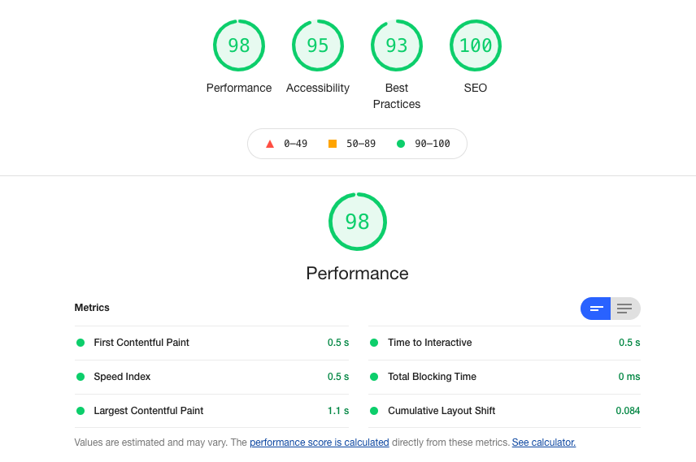

# Bloak

Bloak is a Ruby on Rails engine to provide the functionality of a micro-blog with articles written in Markdown. It includes an attractive admin UI that makes managing and writing new blog articles a breeze. Bloak is lightning-fast, and optimized for SEO, accessibility and supports open-graph meta-tags for rich social media sharing. Easy customization and styling makes Bloak a joy to integrate into your existing web-application and match the host application's look and feel.

## What Does it Look Like?

The Bloak engine was developed in-house to power [our own Blog](https://kuy.io/blog), showcasing a custom style to integrate nicely with our main website.

## Features

- [x] Responsive and mobile friendly
- [x] Google Lighthouse score of 90+ on all categories
- [x] Write Blog posts in Markdown format (extended Github-flavoured markdown)
- [x] SimpleDME markdown editor integration
- [x] Custom Markdown tags for info, warning, quote boxes, table-of-contents and more
- [x] Syntax highlighting for fenced code blocks provided by Rouge
- [x] Custom Markdown renderer supports ERB and HTML tags in Markdown
- [x] Cover images for posts with automatic resizing of preview images
- [x] Post categories
- [x] Filtering for categories
- [x] Full-text search for posts
- [x] Open-Graph meta tags for sharing posts with Twitter, Facebook, Linked-In
- [x] SEO meta tags for blog posts
- [x] Author gravatar images
- [x] Image uploads
- [x] Reading time estimation for articles
- [x] (Optionally) Featured articles that are always displayed on top
- [x] Extensible and customizable view templates and styles
- [x] Admin Interface with authentication
- [x] Uses Bootstrap 5 front-end framework
- [x] Uses Fontawesome 5 icons

### Google LightHouse Scorecard

Google Lighthouse is a free tool that provides a report analyzing page experience and performance. Lighthouse has an increased emphasis on-page user experience, including adding a new set of Core Web Vital signals. The signals break down how a user experiences the page. One of the core design goals for Bloak was lightning-fast, great on-page user experience, so we pay special attention to the LightHouse scores for each release.



## Installation

Add the gem to your application's `Gemfile`:

```ruby
gem 'bloak', git: "https://github.com/kuyio/bloak.git"
```

Then run `bundle install` and use the install generator:

```sh
rails generate bloak:install
```

This will create a configuration initializer, mount the engine at `/blog`, and run all required migrations.

Bloak requires Active Storage for image uploads. If you haven't set it up yet, run `bin/rails active_storage:install` first. The `image_processing` gem also requires `libvips` to be installed on your system.

### Manual Installation

If you prefer to set things up by hand:

```ruby
# config/routes.rb
mount Bloak::Engine, at: "/blog"
```

```sh
bin/rails bloak:install:migrations
bin/rails active_storage:install  # if not already done
bin/rails db:migrate
```

## Configuration

Configure the Bloak engine through an initializer at `config/initializers/bloak.rb` (the install generator creates this for you):

```ruby
Bloak.configure do |c|
  # The name of the site, used in the Navigation Bar, and footer unless a copyright is set
  c.site_name = "My Awesome Blog"

  # The copyright notice in the footer (supports HTML)
  c.copyright = "© 2025 My Awesome Company - all rights reserved"

  # The username for the admin user
  c.admin_user = ENV.fetch('BLOAK_ADMIN_USER')

  # The password for the admin user
  c.admin_password = ENV.fetch('BLOAK_ADMIN_PASSWORD')

  # The number of blog posts to show before pagination (default: 10)
  c.num_items = 10

  # The maximum number of featured posts to display (default: 3)
  c.num_featured_posts = 3

  # The maximum depth to render for the TOC of a post (default: 3)
  c.max_toc_depth = 3

  # Use your app's own layout instead of the engine's built-in layout (default: nil)
  # c.layout = "application"
end
```

**Note:** You must assign a value to `admin_user` and `admin_password`, or Bloak will not serve the admin routes and raise an exception instead.

Also make sure to set your `default_url_options`, so absolute URLs to your assets can be correctly generated, for example in `config/application.rb`:

```ruby
# Default Host for URL Helpers
routes.default_url_options[:host] = 'blog.example.com'
routes.default_url_options[:protocol] = 'https'
```

## The Admin Interface

You can access the admin interface under the `/admin` sub-path of your engine mount, for example, if you mounted the engine at `/blog` the admin UI is available at `/blog/admin`. The Admin UI is secured by HTTP Basic Auth and both `admin_user` and `admin_password` must be set in the `Bloak` configuration (see above).

Within the admin UI, you can upload images for embedding within Blog posts, as well as write and manage Blog posts.

### Security Recommendations

Bloak uses HTTP Basic Auth for the admin panel. For production deployments:

- **HTTPS is required.** Basic Auth credentials are sent Base64-encoded (not encrypted) on every request. Without TLS, they can be intercepted.
- **Rate limiting is recommended.** Bloak does not include brute-force protection. Use [Rack::Attack](https://github.com/rack/rack-attack) or your reverse proxy to throttle login attempts and public search requests.
- **Set strong credentials.** The install generator requires `BLOAK_ADMIN_USER` and `BLOAK_ADMIN_PASSWORD` environment variables with no fallback defaults.

## Writing Posts

Post content is written in [CommonMark](https://commonmark.org/)-compliant Markdown (via [CommonMarker](https://github.com/gjtorikian/commonmarker)) with syntax highlighting by [Rouge](https://github.com/rouge-ruby/rouge). Bloak extends Markdown with custom [Liquid](https://shopify.github.io/liquid/) tags for rich content.

### Custom Liquid Tags

- `text` renders a danger alert box
- `text` renders a warning alert box
- `text` renders an info box
- `text` renders a quote box
- `` embeds an uploaded image by its unique name
- `` or `` inserts a table of contents

### Liquid Variables

Liquid templates support variable interpolation. The following variables are available in every post:

| Variable | Type | Description |
|----------|------|-------------|
| `post` | `Bloak::Post` | The current post object |
| `request` | `ActionDispatch::Request` | The current HTTP request |

Use them in your post content:

```
This post is titled "{{ post.title }}" by {{ post.author_name }}.
```

Liquid is sandboxed by design and cannot execute arbitrary code. To show Liquid tags as literal text in a post, wrap them in `` / ``.

## Customization

There are several levels of customization, from simple theming to full control over every template.

### CSS Variables (Theming)

The fastest way to match your brand. Override any of these CSS custom properties in your application's stylesheet:

```css
:root {
  --bloak-font-family: "Inter", sans-serif;
  --bloak-font-size: 16px;
  --bloak-bg: #ffffff;
  --bloak-text: #333333;
  --bloak-heading: #111111;
  --bloak-link: #e63946;
  --bloak-link-hover: #c1121f;
  --bloak-border: #eeeeee;
  --bloak-muted: #888888;
  --bloak-code-bg: #f4f4f4;
  --bloak-code-text: #d63384;
  --bloak-blockquote-bg: #f9f9f9;
  --bloak-navbar-bg: #ffffff;
  --bloak-footer-bg: #fafafa;
  --bloak-active-tag-bg: #fde8e8;
  --bloak-active-tag-text: #e63946;
}
```

### Layout

By default, Bloak renders inside its own layout with a navbar, footer, and Bootstrap styling. To embed the blog inside your app's existing layout instead:

```ruby
# config/initializers/bloak.rb
c.layout = "application"
```

When using your own layout, include the Bloak stylesheets to keep post rendering intact:

```erb
<%= stylesheet_link_tag "bloak/application" %>
```

### View Overrides

For full control over every template, copy the engine's views into your application:

```sh
rails generate bloak:views
```

Or copy only what you need:

```sh
rails generate bloak:views --scope=layout    # layout templates
rails generate bloak:views --scope=posts     # post index, show, search
rails generate bloak:views --scope=admin     # admin panel
rails generate bloak:views --scope=partials  # header, footer, search box, etc.
```

Rails automatically picks up your local copies over the engine defaults — no additional configuration needed.

### Assets

The engine ships default `logo.png` and `favicon.png` assets. Override them by placing your own files at the same paths in your application:

```
app/assets/images/logo.png      # navbar logo
app/assets/images/favicon.png   # browser favicon
```

### Additional Stylesheets and JavaScripts

Register extra assets to be loaded on every blog page:

```ruby
Bloak::Engine.add_stylesheet("my_blog_styles")
Bloak::Engine.add_javascript("my_blog_scripts")
```

## Development

### Setup

```sh
git clone https://github.com/kuyio/bloak.git
cd bloak
bundle install
rails db:create db:migrate
rails db:seed
```

Start the dummy app:

```sh
cd test/dummy && bin/rails server
```

Visit `http://localhost:3000/blog` for the blog and `http://localhost:3000/blog/admin` for the admin panel (user: `admin`, password: `password`).

### Testing

```sh
make test    # rubocop lint + trivy vulnerability scan
rake test    # full test suite
```

## Roadmap

- [ ] Support for article keyword lists
- [ ] Full authentication system beyond basic auth
- [ ] Commenting system
- [ ] Update UI to Hotwire

## License

The gem is available as open source under the terms of the [MIT License](https://opensource.org/licenses/MIT).
